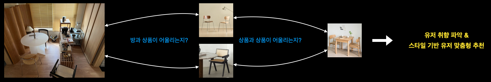
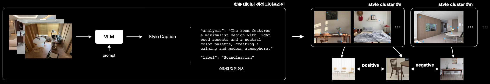

> 이 글은 **커머스 도메인에서 ‘어울림(compatibility)’을 정량화**해 검색/추천 품질을 끌어올리기 위해, **VLM 기반 스타일 soft labeling**과 **metric learning**을 결합해 **컨텍스트 이미지-상품 / 상품-상품 스타일 매칭 모델**을 개발한 경험을 정리한 기록이다.

## 1. 문제 정의

커머스에서 검색/추천의 본질적인 질문은 결국 다음으로 수렴한다.

- 이 **상품**이 사용자의 **컨텍스트 이미지(상황/공간/라이프스타일)**와 어울리는가?
- 이 **상품**이 함께 구매/노출될 **다른 상품**과 조화로운가?

여기서 “어울림”은 카테고리 매칭(예: 상의-하의)이나 단순 유사 이미지 검색만으로는 해결되지 않는다. 실제 구매/만족도에 영향을 주는 건 **색감, 질감, 재질, 톤, 형태, 분위기**처럼 여러 속성이 결합된 **스타일 적합도**이기 때문이다.

스타일은 “A/B/C”처럼 딱 떨어지는 단일 라벨이 아니라, 여러 속성이 섞인 **연속적인 스펙트럼**에 가깝다. 예를 들어 어떤 컨텍스트는 “미니멀 0.6 + 내추럴 0.4 + 웜톤 0.5” 같은 혼합을 가지며, 상품도 “우드 톤 + 라운드 쉐입 + 무광 질감”처럼 다차원 속성으로 표현된다. 따라서 이 문제는 분류보다 임베딩 공간에서 거리로 “어울림”을 다루는 게 자연스럽다.

- 컨텍스트/상품 이미지를 동일한 임베딩 공간에 매핑한다.
- 임베딩 간 거리로 **스타일 유사도/적합도(compatibility)**를 측정한다.
- 이 점수를 검색/추천 랭킹 시그널로 활용한다.

## 2. 접근 방식

초기에는 다음과 같은 파이프라인으로 시작했다.

### 2.1 초기 접근 방식
이미지 → 스타일 텍스트 캡셔닝 → 텍스트 임베딩 → 오토인코더 학습(압축) → 클러스터링 → metric learning
스타일 스펙트럼을 비지도적으로 구조화할 수 있다는 장점이 있었지만, 개발 및 운영 관점에서 한계가 존재했다.

### 2.1 초기 접근의 병목과 한계
우선 **클러스터링 단계가 하이퍼파라미터에 매우 민감**했다. 클러스터 개수, 거리 metric, 압축 차원, 샘플링 방식 등에 따라 이후 단계 품질 차이가 크게 발생하여 개발 과정에서 많은 분석 시간이 필요했다. 또한 파이프라인이 길어질수록 **학습 과정의 원인-결과 분석이 어려워**졌다. 마지막으론 **증분 데이터 유입 시 재학습 비용이 증가**한다는 사실도 단점이었다.

### 2.2 모델 설계 방향 전환
그래서 접근을 전환했다. 클러스터링으로 스타일을 구분하려고 하기보다, 서비스 관점에서 의미 있는 **기정의 스타일 축(style axes)**을 두고, VLM으로 이를 **soft labeling**한 뒤 **metric learning**으로 직접 “어울림”을 학습한다. 이 전환은 단순히 단계를 줄인 것이 아니라, **재학습 가능성, 분석 가능성, 운영 가능성**을 모두 만족시키기 위한 선택이었다.

## 3. 학습 데이터 구축

실무에서 가장 시간을 많이 쓰는 부분은 모델보다 **데이터 설계**였다. 특히 이 과제는 정답 라벨이 딱 떨어지게 존재하지 않기 때문에, weak signal을 얼마나 정직하게 뽑느냐가 핵심이었다.

### 3.1 데이터 소스와 관계 정의
- **컨텍스트 이미지**: 실제 사용 상황을 담은 이미지
- **상품 이미지**: 대표 이미지 + 상세 이미지(스타일 단서가 풍부)
- **컨텍스트-상품 관계(weak supervision)**  
  - 콘텐츠 내 태깅/노출/구성 등 “연결 신호”
- **상품-상품 관계(weak supervision)**  
  - 세트/컬렉션 구성, 함께 노출되는 패턴 등

중요한 점은 상품 간 연결이 있다고 해서 무조건 positive pair는 아니라는 것이다. 노이즈를 고려해 관계 신뢰도를 나누고 샘플링 전략을 설계했다.

### 3.2 정제 전략
- pySpark 기반으로 상품 데이터 스키마 기반으로 필터링할 수 있는 것은 최대한 필터링
- 기존 데이터로 걸러내지 못한 노이즈 데이터는 모델 기반으로 필터링
- 오탐 태깅/잘못된 매칭 제거(규칙 기반 + 통계 기반)
- 저품질 이미지 제거(블러/워터마크/중복/극저해상도)
- 컨텍스트 정보량이 부족한 샷 제외(너무 근접, 어두움, 정보 부족)
- 상품 이미지도 스타일 표현력이 낮은 컷 제외(로고 중심, 극단적 클로즈업)
- 중복/비슷한 이미지 제거

목표는 데이터를 많이 모으는 것이 아니라, **스타일 학습에 고품질 학습 데이터 비율을 높이는 것**이었다.

### 3.3 VLM 기반 soft labeling

클러스터링을 제거했다고 스펙트럼을 포기한 게 아니다. 더 명시적으로 정의했다.

### 3.3.1 기정의 style taxonomy 설정
커머스 도메인에서 반복적으로 의미가 있는 스타일 축을 정의한다. 

예를 들면, 아래와 같은 축을 Ground Truth로 고정하는 대신 **soft label의 좌표계**로 사용한다.
- Minimal / Modern / Natural / Classic / Industrial …
- Warm / Cool tone
- Wood / Metal / Fabric 같은 재질 중심성
- Rounded / Angular 형태 등

### 3.3.2 VLM 캡셔닝 → 스타일 soft label 생성
이미지를 VLM으로 분석하되, “단정”이 아니라 “추정 + 근거”를 뽑도록 유도했다.

- 전체 분위기(톤/무드)
- 주요 재질/색감
- 형태적 특징
- 스타일 키워드 confidence 기반 해석

결과적으로 각 이미지(컨텍스트/상품)는 다음처럼 표현된다.

- `style_distribution = {modern:0.5, minimal:0.3, natural:0.2}`

이 방식은 새 데이터가 들어와도 VLM으로 즉시 라벨링할 수 있어, 증분 데이터 대응과 재학습이 훨씬 쉬워진다.

## 4. 스타일 매칭 모델 학습 및 평가

최종 목표는 **컨텍스트/상품 이미지를 동일한 임베딩 공간에 매핑**하고, 임베딩 거리로 스타일 “어울림(compatibility)”을 계산하는 것이다. 다만 이 프로젝트에서 중요한 전제는, 스타일이 hard label이 아니라 **soft distribution**이라는 점이다.

즉, 학습도 “같다/다르다(1/0)”로 끊기지 않고, 다음처럼 **분포 간 유사도**를 감독 신호로 사용했다.

- `style_distribution = {modern:0.5, minimal:0.3, natural:0.2, ...}`

### 4.1 모델 아키텍처

- Vision backbone: **SigLIP2**
- Projection head: **MLP**
- Output: **L2-normalized embedding**

Retrieval 시스템에서 바로 재사용 가능한 형태로 설계했다. 모델 크기를 키우기보다, **어떤 supervision을 주느냐(soft label 기반)**와 **pair 설계**가 성능을 더 크게 좌우했다.

### 4.2 Soft label 기반 supervision 설계

일반적인 metric learning은 positive/negative를 1/0으로 두고 학습하는 경우가 많다. 하지만 커머스 스타일은 경계가 흐리고 섞여 있기 때문에, 이를 그대로 적용하면 다음 문제가 생긴다.

- 경계 샘플이 과도하게 negative로 밀리거나
- “비슷하지만 미묘하게 다른” 관계를 설명하지 못하고
- 결국 임베딩 공간이 딱딱한 군집 형태로 굳어지는 문제가 발생한다.

그래서 이 프로젝트에서는 **style distribution 간 유사도를 연속 값으로 정의**하고, 이를 supervision으로 사용했다.

### 4.2.1 분포 기반 유사도 정의
각 이미지에 대해 VLM으로 얻은 스타일 분포 `p(s)`가 있을 때 `w = sim(p_i, p_j)` 을 **pair weight / target similarity**로 사용했다.

### 4.2.2 threshold 기반 pair sampling + soft supervision
학습 샘플링은 운영 관점에서 단순한 규칙을 유지했다.

- `w >= t_pos` : positive 성격이 강한 pair (강한 pull)
- `w <= t_neg` : negative 성격이 강한 pair (강한 push)
- `t_neg < w < t_pos` : 애매한 구간은
  - 학습에서 제외하거나(노이즈 제거),
  - 혹은 “약한 positive/negative”로 낮은 가중치로 포함

중요한 건 **threshold는 pair를 뽑기 위한 기준**이고, 학습 자체는 1/0이 아니라 `w`라는 **연속 값**을 그대로 반영했다는 점이다.

### 4.3 Loss

목표는 단순히 “가깝게/멀게”가 아니라, **스타일 분포가 비슷한 정도만큼** 임베딩도 비슷해지도록 만드는 것이다.

이를 위해 pair (i, j)에 대해

- 모델 임베딩 유사도: `s_ij = cos(e_i, e_j)`
- 타깃 유사도(soft label): `w_ij = sim(p_i, p_j)`

를 두고, `s_ij`가 `w_ij`를 따라가도록 학습했다.

### 적용한 형태
- **Weighted Supervised Contrastive Loss**
  - positive/negative를 binary로 고정하지 않고, `w_ij`를 가중치로 사용
- **Soft Triplet / Ranking Loss**
  - anchor 기준으로, “더 비슷한 분포”를 가진 샘플이 더 가깝도록 정렬
- **Hard/Negative Mining**
  - 임베딩 상으로는 가깝지만 분포 유사도 `w`가 낮은 샘플을 hard negative로 우선 학습  
  - 단, 분포 기반 supervision이 있기 때문에 “무작정 밀어내기”가 아니라 **밀어낼 강도**도 함께 제어 가능

정리하면 아래와 같다.

- 샘플링은 threshold로 단순화하고,
- Supervision signal는 soft similarity로 연속화하여,
- 스타일 스펙트럼을 임베딩 공간에 자연스럽게 반영했다.

### 4.4 평가

이 문제는 정답 라벨이 애매하기 때문에, 평가도 두 축으로 봤다.

### 4.4.1 Retrieval 기반 랭킹 품질
- 컨텍스트 query → 상품 top-k: 어울리는 상품이 상위에 오는지
- 상품 query → 상품 top-k: 함께 노출/구성되는 상품이 상위에 오는지
- 정량 지표: Recall@K, nDCG@K

### 4.4.2 스펙트럼 보존 관점의 정성/정량 체크
- 임베딩 거리와 분포 유사도 `w`의 상관(랭킹/상관계수)을 모니터링
- 스타일 경계(혼합 스타일) 샘플에서 top-k가 “한쪽으로 쏠리지 않는지” 확인
- 실패 케이스를 다음처럼 유형화해 원인을 추적
  - 비슷하지만 안 어울림(과도한 similarity 편향)
  - 달라도 어울림(스펙트럼 표현 실패)
  - 특정 스타일 축에서만 무너짐(soft label 편향/데이터 불균형)

---

이 프로젝트는 스타일이라는 애매한 개념을 서비스에서 다룰 수 있는 형태로 정량화하는 과정이었다.

초기에는 unsupervised 기반 clustering으로 스타일 공간을 만들려 했지만, 운영/분석/재학습 관점에서 병목이 명확했다. 그래서 아래와 같은 방식으로 접근을 전환했다.

- VLM으로 스타일 공간을 **soft supervision(스타일 분포)** 형태로 구조화하고
- metric learning으로 **분포 기반 유사도(연속값)**를 학습 신호로 사용해 “어울림”을 직접 학습했다.

그 결과, 단일 라벨로 정의하기 어려운 **스펙트럼 형태의 상품 스타일**에서도, 컨텍스트-상품 / 상품-상품 조합의 **어울림 정도를 연속적인 점수로 예측**할 수 있는 매칭 모델을 구축할 수 있었다.